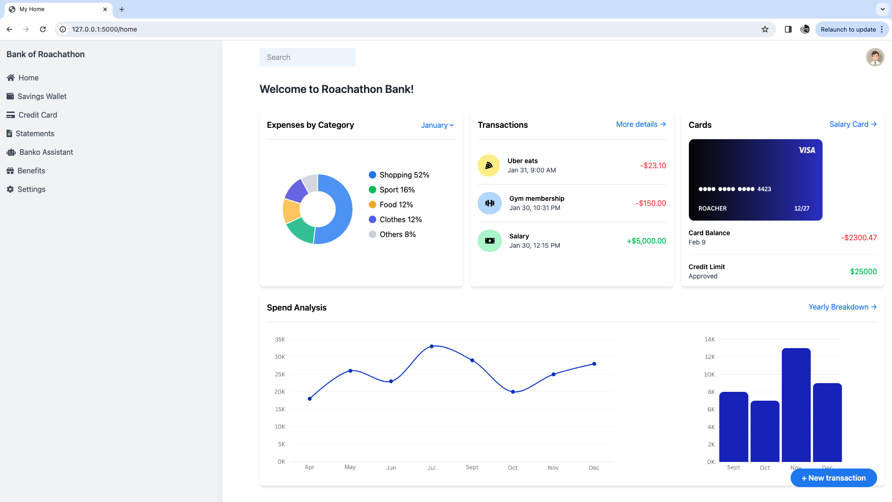

# Banko Assistant App

## Overview
Banko AI is a conversational banking assistant that helps users analyze and understand their financial data through natural language interactions. Built with Flask, it can use AWS Bedrock and Claude AI models or any other model, this application implements Retrieval Augmented Generation (RAG) to provide accurate, context-aware responses about personal expenses and financial information.

## Features
- **Natural Language Interface**: Query your expense data using everyday language
- **AI-Powered Responses**: Leverages Claude 3.5 Sonnet via AWS Bedrock for intelligent responses
- **Expense Search**: Quickly find and analyze your spending patterns
- **Interactive Chat UI**: Clean, intuitive interface for seamless conversations
- **Secure Session Management**: Maintains conversation history within user sessions
- **Banking Dashboard**: Integrated with a comprehensive banking interface

## Technical Stack
- **Backend**: Flask (Python)
- **AI/ML**: 
  - AWS Bedrock for LLM capabilities
  - Claude 3.5 Sonnet model
  - Sentence Transformers for embeddings
  - OpenAI models
  - Open Source Models
- **Database**: CockroachDB
- **Frontend**: HTML, Tailwind CSS
- **Cloud Infrastructure**: AWS


##### Banko Assistant App /Home

##### Banko Assistant /Banko


## Getting Started

### Prerequisites
- Python 3.8+
- AWS account with Bedrock access
- CockroachDB instance
- OpenAI API key (for certain functionalities)

### Installation
1. Clone the repository
   ```
   git clone https://github.com/david7joy/banko-ai-assistant.git
   ```

2. Install dependencies
   ```
   pip install -r requirements.txt
   ```

3. Configure your environment
   - Create a `config.py` file with your API keys
   - Configure AWS credentials for Bedrock access

4. Run the application
   ```
   python app.py
   ```

5. Access the application at `http://localhost:3000/home`

## Usage
1. Navigate to the Banko Assistant section from the sidebar
2. Type your financial query in natural language (e.g., "How much did I spend on restaurants last month?")
3. Receive AI-generated responses based on your expense data
4. Continue the conversation to explore your finances further

## Project Structure
- `app.py`: Main Flask application
- `aws_bedrock.py`: Functions for AWS Bedrock integration
- `bedrock_search.py`: Implementation of AWS Bedrock search capabilities
- `cockroachdb/`: use the code available to create schema, generate sample data and even test search capabilities.
- `templates/`: HTML templates for the web interface
  - `index.html`: Chat interface
  - `dashboard.html`: Banking dashboard

## Future Enhancements
- Voice input/output capabilities
- Financial insights and recommendations
- Budget planning assistance
- Transaction categorization
- Multi-language support

## License
[MIT License](LICENSE)

## Acknowledgements
- AWS Bedrock for providing the AI infrastructure
- Anthropic for the Claude AI model
- CockroachDB for database services